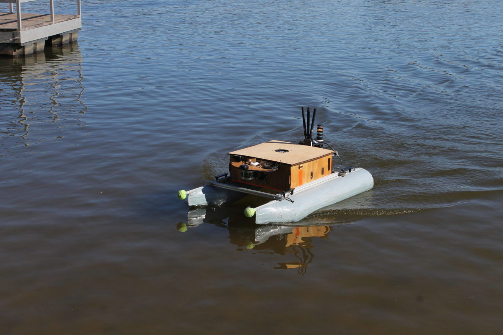

# Vinny (ASV2016)

This autonomous surface vehicle (ASV) competed in RoboBoat 2017, 2018, and 2019. The large pontoon boat design provides a large degree of stability and lots of surface area for electronics. Originally designed to accommodate a very large battery, this boat is very big. 
Fortunately its modular design allows for it to be disassembled for transport. This autonomous surface vehicle (ASV) competed in RoboBoat 2017, 2018, and 2019. The large pontoon boat design provides a large degree of stability and lots of surface area for electronics. It was utilized again for testing purposes for RoboBoat 2023.

## Videos

	<iframe width="560" height="315" src="https://www.youtube.com/embed/V7n5ZDMc9cE" title="YouTube video player" frameborder="0" allow="accelerometer; autoplay; clipboard-write; encrypted-media; gyroscope; picture-in-picture; web-share" allowfullscreen></iframe>

	<iframe width="560" height="315" src="https://www.youtube.com/embed/6lkEJhuf5Bw" title="YouTube video player" frameborder="0" allow="accelerometer; autoplay; clipboard-write; encrypted-media; gyroscope; picture-in-picture; web-share" allowfullscreen></iframe>

