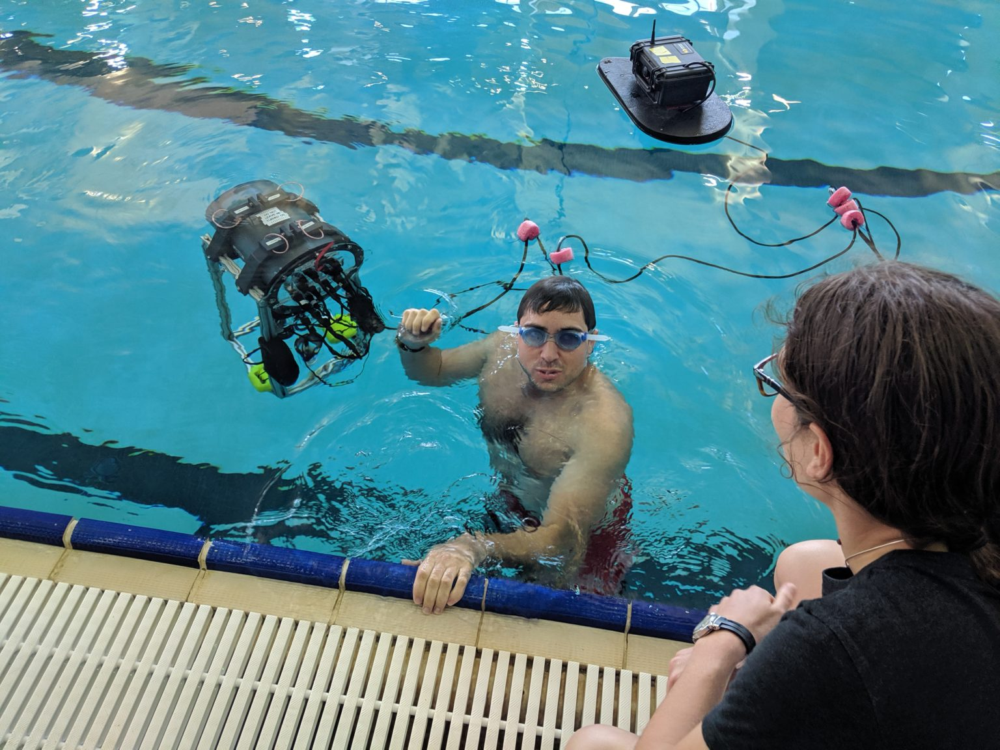

# Plongeur (AUV2016)

Plongeur has competed in the RoboSub 2017, 2018, and 2019 competitions. The design consists of a pressure vessel at the top with weights at the bottom, providing great stability on the roll and pitch axes, simplifying the control problem. It is equipped with 3 Blue Robotics T200 thrusters.

## Video

<iframe width="560" height="315" src="https://www.youtube.com/embed/JkQFMKRP4yU" title="YouTube video player" frameborder="0" allow="accelerometer; autoplay; clipboard-write; encrypted-media; gyroscope; picture-in-picture; web-share" allowfullscreen></iframe>

